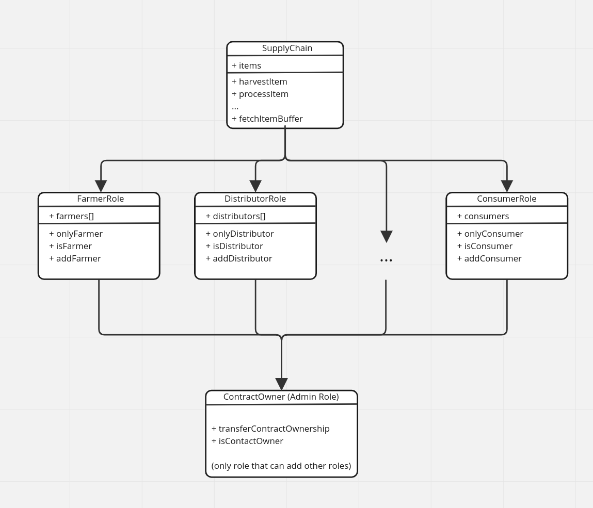
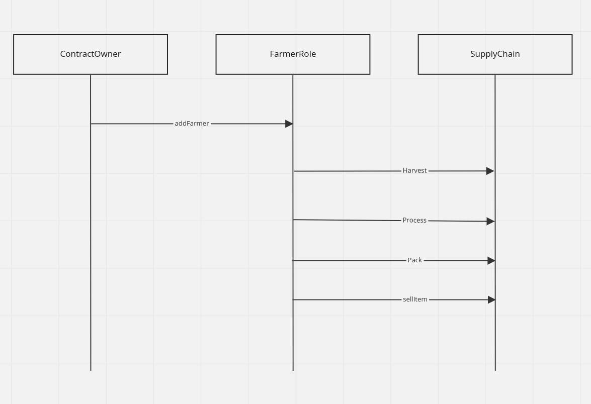
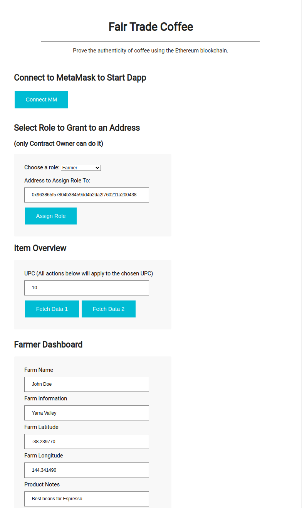
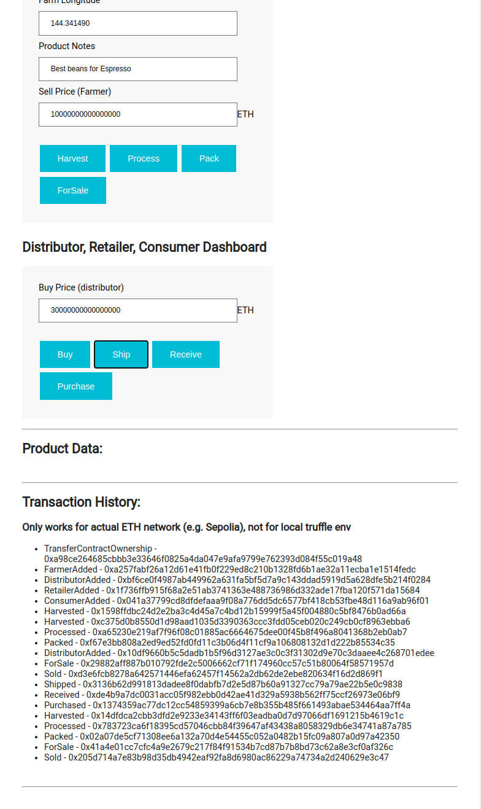

# Supply chain Dapp

Supply Chain Tracking on Ethereum

This repository containts an Ethereum DApp that demonstrates a Supply Chain flow between a Seller and Buyer. The user story is similar to any commonly used supply chain process. A Seller can add items to the inventory system stored in the blockchain. A Buyer can purchase such items from the inventory system. Additionally a Seller can mark an item as Shipped, and similarly a Buyer can mark an item as Received.

## Getting Started

These instructions will get you a copy of the project up and running on your local machine for development and testing purposes. See deployment for notes on how to deploy the project on a live system.

### Prerequisites

Please make sure you've already installed ganache-cli, Truffle and enabled MetaMask extension in your browser.

### Installing

```
cd supply_chain
npm install

# Run tests
truffle develop 
> test  # in truffle console, exit to proceed (ctrl+c) 

# Deploying DApp to the network
# Compile truffle contracts
truffle compile 

# Option 1. Deploy DApp to the local ganache network
truffle migrate --network local

# Option 2. Deploy DApp to Sepolia testnet
touch .env  # create .env file and put your sepolia private key under PRIVATE_KEY_SEPOLIA (see truffle-config for use case)
truffle migrate --network sepolia  # truffle is flaky, so if encounter error just try deploying again

# Launch frontend
npm run dev  # better use live server as it's more convenient and less flaky than npm
```

## Libraries
(see package.json)
1. `lite-server` for local frontend development in vscode
2. `truffle/hdwallet-provider` for using private keys
3. `dotenv` for storing private keys

## Diagrams 




The DApp User Interface when running looks like...




